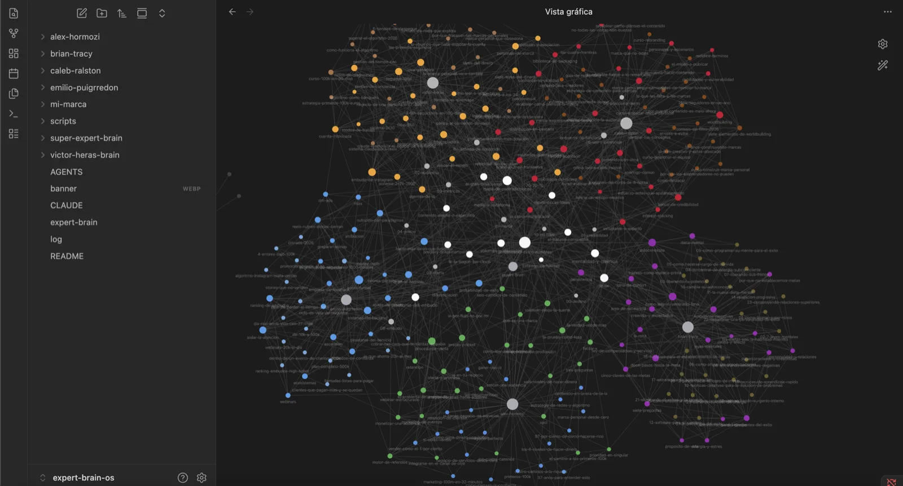
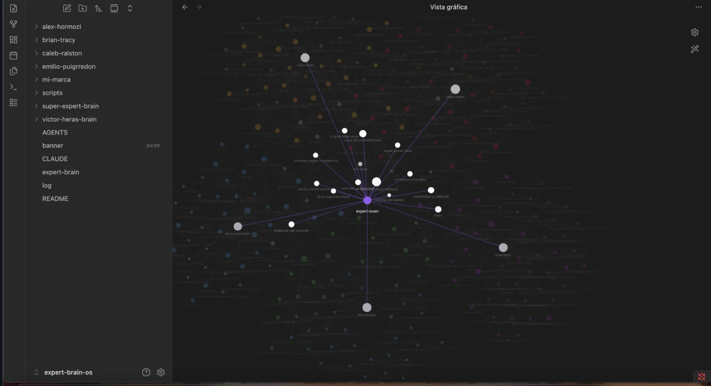
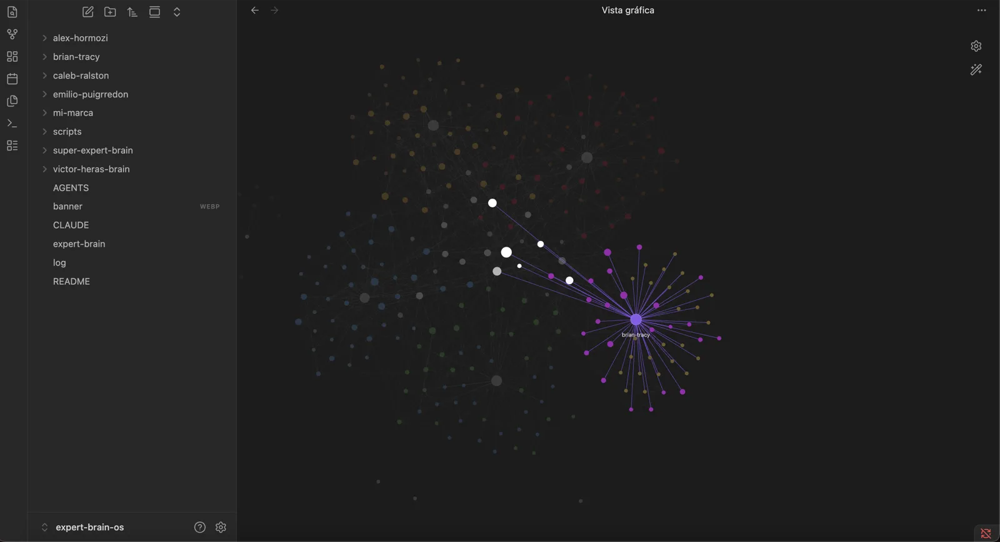
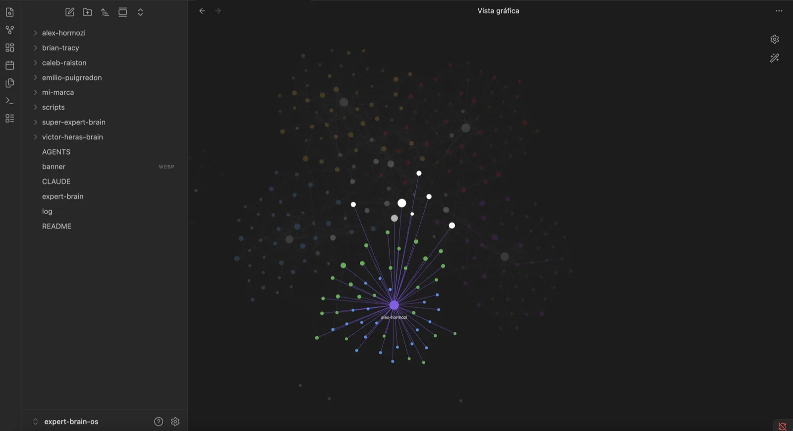

# expert-brain

**Cinco operadores que viven de la atención, con sus fuentes y sus desacuerdos.**

Un segundo cerebro sobre cómo se convierte atención en ingresos, destilado de 109 fuentes
originales de cinco expertos que no están de acuerdo entre sí.

No es una lista de tácticas. Cada afirmación se puede seguir hasta el vídeo en que alguien la
dijo, y cuando dos expertos se contradicen, el conflicto está escrito en vez de disimulado.

---

## Qué hace

Te ayuda a tomar decisiones concretas sobre tu negocio y tu contenido, con el respaldo de quién lo
dice y con qué prueba:

- **Definir tu oferta** y ponerle precio.
- **Definir a quién le hablas** — y por qué tu cliente ideal no es tu audiencia.
- **Encontrar tu voz** y lo que solo tú puedes decir.
- **Diagnosticar** por qué tu cuenta no crece, con métricas y umbrales.
- **Montar un sistema de contenido** que puedas sostener.
- **Construir el embudo** que convierte esa atención en clientes.

Las recetas concretas están abajo.

## Qué no es

- **No es un curso.** No hay un orden. Se entra por la pregunta que tengas.
- **No son las palabras de los expertos.** Es destilación con citas. Para lo que dijeron
  literalmente, están los enlaces a los vídeos originales.
- **No es neutral.** Cada brain tiene una página `como-leer-a-…` con los sesgos, el contexto y los
  datos que no se sostienen del experto en cuestión.

---

## Los cinco

| Experto | Qué cubre | Fuentes |
|---|---|---|
| [Brian Tracy](experts/brian-tracy/) — Seminario Fénix | El operador: metas, autoconcepto, persistencia | 25 módulos |
| [Víctor Heras](experts/victor-heras/) | La atención: algoritmo, formato, ganchos, diagnóstico | 19 |
| [Caleb Ralston](experts/caleb-ralston/) | La confianza: marca, worldbuilding, prueba | 27 |
| [Emilio Puigrredon](experts/emilio-puigrredon/) | La conversión: embudos, webinars, stories, precio | 17 |
| [Alex Hormozi](experts/alex-hormozi/) | El negocio: oferta, retención, márgenes, estructura | 21 |

Ninguno cubre los cinco tramos. Juntos sí.

**[experts/super-expert-brain/](experts/super-expert-brain/)** es el centro: dónde se contradicen, dónde coinciden,
y el linaje entre ellos.

---

## Empieza por aquí

Clona el repo, ábrelo en Obsidian y ve a **[`work/mi-marca/`](work/mi-marca/)**. Son once fichas en blanco
—destino, audiencia, oferta, voz, contenido, embudo, precio, métricas, tu filtro— y cada una trae
enlazadas las páginas de los cinco expertos que responden esa pregunta.

Rellenarlas es el trabajo. El resto del repo es material para hacerlo.

La última, `10-mi-filtro`, es la que más rinde y la que nadie escribe: qué de estos cinco te sirve
tal cual, qué te sirve traducido y qué no entra en tu caso. Sin ella acabas aplicando consejos
pensados para el negocio de otro.

---

## Cómo usarlo

### Recetas

Cada una es una secuencia de páginas en orden. Léelas seguidas.

**Definir tu oferta**
1. `experts/alex-hormozi/wiki/oferta-y-promesa` — producto contra oferta; inventar el nivel de arriba
2. `experts/alex-hormozi/wiki/el-problema-del-commodity` — dejar de competir por precio
3. `experts/victor-heras/wiki/vender-el-espejo` — vender el resultado, no el proceso
4. `experts/super-expert-brain/wiki/precio-y-ticket-comparado` — qué ticket, según quién

**Definir tu avatar**
1. `experts/victor-heras/wiki/seguidor-ideal` — por qué tu cliente ideal no es tu audiencia
2. `experts/victor-heras/wiki/niveles-de-conciencia` — el 90% no sabe que tiene el problema
3. `experts/caleb-ralston/wiki/problema-doloroso-mas-solucion` — el contraargumento
4. `experts/super-expert-brain/wiki/el-gran-desacuerdo` — cómo se resuelve la contradicción

**Encontrar tu voz**
1. `experts/caleb-ralston/wiki/worldbuilding` — los siete elementos
2. `experts/alex-hormozi/wiki/factor-x` — rasgos raros que no suelen coexistir
3. `experts/caleb-ralston/wiki/contenido-con-alma` — lo que solo tú puedes hacer
4. `experts/victor-heras/wiki/personaje-de-marca` — identificación, aspiración, reconocimiento

**Diferenciarte**
1. `experts/caleb-ralston/wiki/enemigo-comun` — postura contraria, no llamar la atención sobre otros
2. `experts/caleb-ralston/wiki/redefinir-terminos` — definiciones operativas como foso
3. `experts/alex-hormozi/wiki/la-prueba-como-foso` — qué te protege de la IA
4. `experts/victor-heras/wiki/resultados-que-respaldan` — casos, no visitas

**Diagnosticar tu cuenta**
1. `experts/victor-heras/wiki/ratios-de-diagnostico` — los umbrales
2. `experts/victor-heras/wiki/cuenta-intoxicada` — saludable, crítica o intoxicada
3. `experts/victor-heras/wiki/cuenta-validada` — las seis señales de despegue

**Montar tu sistema de contenido**
1. `experts/caleb-ralston/wiki/metodo-acordeon` — expandir para aprender, contraer para concentrar
2. `experts/caleb-ralston/wiki/70-20-10` — el reparto
3. `experts/caleb-ralston/wiki/distribucion-en-cascada` — pilar y micro
4. `experts/victor-heras/wiki/la-fotocopiadora` — replicar lo que funcionó
5. `experts/super-expert-brain/wiki/el-fracaso-como-dato` — publicar es medir

**Construir tu embudo**
1. `experts/emilio-puigrredon/wiki/ranking-de-embudos` — cuál elegir
2. `experts/emilio-puigrredon/wiki/embudos-de-confianza` — calentar tráfico frío
3. `experts/alex-hormozi/wiki/webinar-estructurado` — la estructura
4. `experts/alex-hormozi/wiki/proceso-de-venta` — preguntar preferencias, no datos

**Ponerte en marcha (el operador)**
1. `experts/brian-tracy/wiki/siete-preguntas` — el ejercicio, repetible cada mes
2. `experts/brian-tracy/wiki/area-de-excelencia` — atención, interés, absorción
3. `experts/brian-tracy/wiki/doce-pasos-hacia-la-meta` — la metodología
4. `experts/brian-tracy/wiki/la-roca` — el obstáculo principal, no los pequeños

### Con comandos

Si lo abres con Claude Code, el repo trae cinco skills. **Las cinco leen a los cinco expertos** —
si una respuesta sale de uno solo, no has usado el repo — y las cinco escriben en `work/mi-marca/`.

| Comando | Para qué | Fichas que toca |
|---|---|---|
| `/marca` | Quién eres y cómo suenas | credibilidad · posicionamiento · voz |
| `/contenido` | Qué publicas y por qué no llega | audiencia · contenido · métricas · diagnóstico |
| `/ventas` | Qué vendes y a cuánto | oferta · precio · embudo |
| `/mentalidad` | El operador: metas, foco, bloqueo | destino |
| `/preguntar` | Cualquier cosa que cruce varias | la que toque |

No hay que saber cómo se llama tu problema: disparan con el síntoma. *"Me comparan solo por
precio"* entra por `/ventas`; *"publico todos los días y no pasa nada"* por `/contenido`.

Y hacen las dos cosas en el mismo sitio: le preguntas y te responde con citas, o le dices "vamos
a definir mi voz" y te lleva por la ficha. Preguntar y decidir es el mismo trabajo.

**Lo que ninguna hace es decidir por ti.** Una respuesta por turno, y nunca una que no hayas
dicho o aprobado. Si la escribe la máquina, en seis meses estás sosteniendo en público una
postura que no es tuya.

Cuando discrepan, **el desacuerdo va antes que la respuesta**. Un consenso falso es peor que no
responder.

### Con un agente

Está pensado para leerse con un agente de IA apuntando a la carpeta. Funciona bien porque cada
página es corta, cita su fuente y enlaza a las relacionadas.

Ejemplos que funcionan:

- *"Según expert-brain, ¿qué le falta a mi oferta? Aquí está."*
- *"¿En qué se contradicen Heras y Ralston sobre contenido, y cuál aplica a mi caso?"*
- *"Diagnostica mi cuenta con los ratios de Heras: tengo X seguidores y Y visitas."*

Pídele siempre que **cite la página**. Y si la respuesta importa, que baje al vídeo — cada ficha
de `raw/transcripciones/` lleva el enlace.

### En Obsidian

Clona y abre la carpeta como vault. Los `[[enlaces]]` resuelven entre brains, y la vista de grafo
es la forma más rápida de ver la estructura: **281 notas, 1.536 enlaces, ninguno roto.**



Cada experto es un color y forma su propio cúmulo. No es decoración: si una idea aparece en dos
colores, es que dos personas que no se conocen llegaron a lo mismo por caminos distintos, y eso
pesa más que cualquiera de ellas por separado.

**El nodo morado del medio es `expert-brain`**, y a su alrededor orbitan las páginas que ningún
brain puede contener solo — las contradicciones, los consensos y el linaje:



Y al pinchar cualquier experto se enciende lo suyo y se apaga el resto. Sirve para ver de un
vistazo qué cubre cada uno y, sobre todo, **qué no cubre**:

| Brian Tracy | Alex Hormozi |
|---|---|
|  |  |

Tracy queda aparte a propósito: es de otra época y de otro tema. Los enlaces que sí tiene con los
demás son los que más rinden, porque son coincidencias entre gente que no se copió.

---

## Cómo está construido

```
expert-brain/
├── expert-brain.md              entrada y centro del grafo
│
├── experts/                     lo que lees — nunca se reescribe
│   ├── <experto>/
│   │   ├── <experto>.md         índice del brain y núcleo de su cúmulo
│   │   ├── raw/transcripciones/ una ficha por fuente: título, autor, enlace al vídeo
│   │   └── wiki/                destilado, citando la ficha en cada afirmación
│   └── super-expert-brain/wiki/ el cruce entre los cinco
│
├── work/                        lo que escribes — es tuyo
│   ├── mi-marca/                once fichas, más diagnostico.md e historial.md
│   └── contenido/               guiones, ganchos, borradores
│
├── .claude/skills/              los cinco comandos, para Claude Code
├── scripts/ingest.py            regenera el texto de las fuentes en local
├── img/  log.md
```

El corte de la raíz es **lo que lees contra lo que escribes**. `experts/` se lee y no se toca;
`work/` es tuyo y el repo no lo necesita para funcionar — puedes añadirlo a `.gitignore` si haces
fork público.

**Las transcripciones completas no están en el repo.** Son obra de sus autores, así que aquí solo
va la síntesis, y `raw/transcripciones/` guarda una ficha por fuente con el enlace al vídeo.
`scripts/ingest.py` te baja el texto corrido a `raw/texto/` si quieres trabajar sobre él.

La regla que separa las capas: **la fuente se lee y no se reescribe; el wiki es destilado y
siempre cita.** Si una página del wiki no se puede rastrear hasta una fuente, sobra.

El centro tiene su propia regla: si una página se puede escribir leyendo un solo brain, no va ahí.

## Método

1. Bajar las transcripciones con `yt-dlp` (pista original, sin traducciones automáticas encima).
   Trampa: el cliente por defecto choca con el bot-check y devuelve un 429 que parece "no hay
   subtítulos". Usa `player_client=web_embedded`.
2. Leerlas enteras.
3. Escribir una página por **concepto**, no por vídeo, cruzando fuentes.
4. Enlazar todo y verificar: cero enlaces rotos, cero páginas huérfanas, cero fuentes sin citar.
5. Escribir la página `como-leer-a-…` con los sesgos y los datos que no se sostienen.

El paso 5 es el que más valor añade y el que nadie hace.

---

## Créditos

El mérito del contenido es de sus autores. Lo que hay aquí es lectura, síntesis y criterio propio,
con enlaces de vuelta a los originales.

- [Brian Tracy](https://www.briantracy.com) · [Alex Hormozi](https://www.youtube.com/@AlexHormozi)
  · [Caleb Ralston](https://www.youtube.com/@CalebRalston)
  · [Víctor Heras](https://www.youtube.com/@Victorherasmedia)
  · [Emilio Puigrredon](https://www.youtube.com/@EmilioPuigrredon)

Si eres uno de ellos y quieres que algo se retire, abre un issue.

## Aviso

Destilación interpretativa, no transcripción. Puede contener errores de lectura míos. Para
citar a alguien, ve a su vídeo — cada página enlaza al suyo.

Construido con el kit [second-brain-kit](https://github.com/chrisenprod/second-brain-kit).
